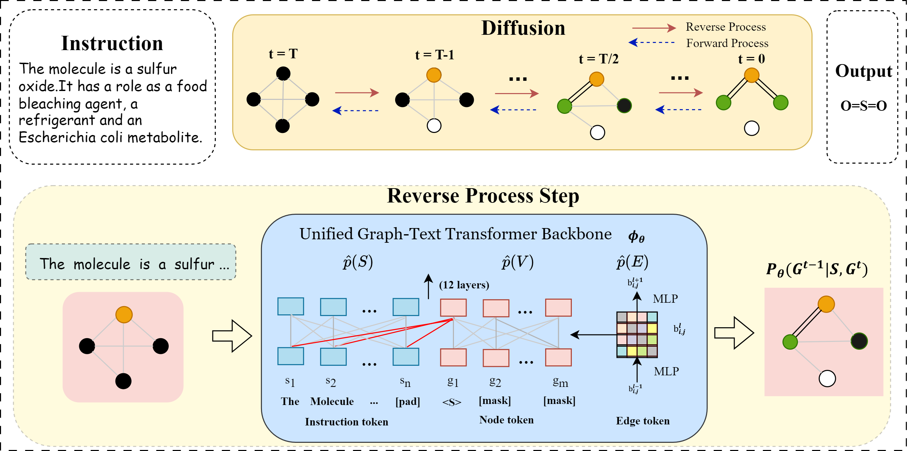

# Instruction-Based Molecular Graph Generation with Unified Text-Graph Diffusion Model (UTGDiff)

This is the code for the Paper: Instruction-Based Molecular Graph Generation with Unified Text-Graph Diffusion Model

UTGDiff incorporates attention bias into the vanilla transformer, forming a unified text-graph transformer that serves as a denoising network for discrete graph diffusion to generate molecular graphs from instructions. Noise decays some nodes and edges into [MASK] during training (forward process), with the reverse process aiming to recover original graphs as the training objective. Sampling starts with a masked graph and iterates T times to reduce noise. The framework are as follows:



## Environment setup

The basic environment requirement is pytorch, here's an example for environment setup:

```
cd ./text-graph-diffusion/
conda create -n UTGDiff python=3.10
conda activate UTGDiff
conda install pytorch torchvision torchaudio pytorch-cuda=12.1 -c pytorch -c nvidia
pip install -r requirements.txt 
```

All the model checkpoint is saved at https://drive.google.com/drive/folders/18EqQ7MDHesmtiMiZz2o09PyeSwyf0hXb?usp=drive_link

## Generation

The generation code is under the ./generation dir

```
cd ./generation/
```

To train the model from roberta-base, run the below command directly:

```
CUDA_VISIBLE_DEVICES=0,1 torchrun --nproc_per_node 2 --master_port 29501 main_dist.py
```

To load the pretrain checkpoint, you can put the files in ./pretrain_model from google drive under the ./generation folder, then run:

```
CUDA_VISIBLE_DEVICES=0,1 torchrun --nproc_per_node 2 --master_port 29501 main_dist_pretrain.py
```

After training, to sample from the model, run:

```
python predict_downstream_dist.py
python aro.py
```

change the --ckpt_path argument in predict_downstream_dist.py to your model, or you can download the model in the ./generation dir from google drive as your generation model.

We have provide a generation result saved at ./generation/generation_results; We have provided the log for CHEBI datasets in google drive, under ./log

To eval the sampling results, run:

```
python eval.py
```

All the metrics are left in the file, choose the metric you need.

## Editing

The generation code is under the ./editing dir

```
cd ./editing/
```

For molecule editing, we choose the MOIfp and MOIretro as our datasets. The datasets files are under ./dataset of google drive, put it under editing/dataset as the preperation of datasets.

To load the pretrain checkpoint, you can put the files in ./pretrain_model from google drive under the ./editing folder, then run: (choose an existing path as save_path)

Train:
```
CUDA_VISIBLE_DEVICES=0,1 torchrun --nproc_per_node 2 --master_port 29501 main_dist_pretrain.py --task_name {MOIretro/MOIfp} --save_path {...}
```
After training, to sample from the model, run:
```
python predict_downstream_dist.py
```
To eval the sampling results, run:

eval:

```
python eval_MOIretro.py

python eval_MOIfp.py
```

Add the metrics you need as the code under the generation part.  We have provided the editing result saved at ./editing/generation_results. We have provided the log for two editing datasets in google drive, under ./log

